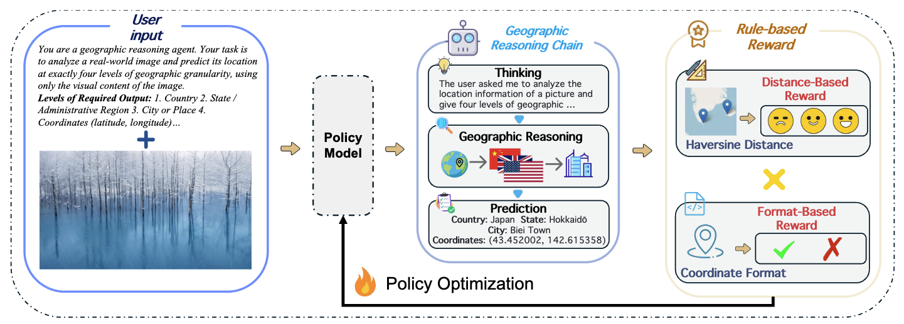

# Vision-Language Reasoning for Geolocalization: A Deep Reinforcement Learning Approach


<div align="center">

<div>
  <font size=4>
    <p>🎉  <b> Overview of Geo-R for image geolocation. Given a query image, the agent generates a region-level reasoning chain grounded in geographic knowledge, followed by coordinate prediction. The framework integrates structured prompting, multi-modal understanding, and reinforcement optimization to enhance both interpretability and spatial accuracy.  </b></p>
  </font>
</div>
</div>


## 🛠️ Setup

```bash
conda create -n Geo-R python=3.10
conda activate Geo-R
bash setup.sh
```


## 💪🏻 Training

### Referring Expression Comprehension (REC)

#### 📚 GRPO

1. Download the Our RL Data and unzip it, and we refer to the image dir as `<your_image_root>`. 
2. Change the `data_paths` and `image_folders` in the [run_scripts/run_grpo_rec.sh](run_scripts/run_grpo_rec.sh) file.

```bash
# These jsonl files are included in the annotation files at step 2.
# Note: please use jsonl files instead of json files.
data_paths="path/to/GEO_R_Train.json"
image_folders="path/to/GEO-R"
```

4. ``bash run_scripts/run_grpo_rec.sh``

> [!NOTE]
> If you encounter 'CUDA out of memory' error, you can try to reduce the `per_device_train_batch_size`.


#### 📚 SFT

We use [LLaMA-Factory](https://github.com/hiyouga/LLaMA-Factory) to train the SFT model.

1. Clone the [LLaMA-Factory](https://github.com/hiyouga/LLaMA-Factory) repository and install the dependencies.

```bash
git clone https://github.com/hiyouga/LLaMA-Factory.git
cd LLaMA-Factory
pip install -e ".[torch,metrics]"
```

2. Download the dataset_info.json, mllm_rec_json.json, and qwen2_5_vl_full_sft.yaml we provided [here](https://huggingface.co/datasets/omlab/VLM-R1/tree/main/sft_related). Put the json files in the `LLaMA-Factory/data` directory and the yaml file in the `LLaMA-Factory/examples/train_full` directory.
3. Run the following command to train the SFT model.

```bash
llamafactory-cli train examples/train_full/qwen2_5_vl_full_sft.yaml
```

### For your own data

<div style="text-align: justify;">

We support data loading the jsonl data of this format in [`src/open-r1-multimodal/src/open_r1/grpo_jsonl.py`](src/open-r1-multimodal/src/open_r1/grpo_jsonl.py). Please note that you may need to use different reward functions for your specialized tasks. Welcome to PR to add your own reward functions or share any other interesting findings!

</div>

The jsonl has the format as follows:

```json
{
  "id": 1,
  "image": "Clevr_CoGenT_TrainA_R1/data/images/CLEVR_trainA_000001_16885.png",
  "conversations": [
    {"from": "human", "value": "<image>What number of purple metallic balls are there?"},
    {"from": "gpt", "value": "0"}
  ]
}
```

If you want to use multi-image input, you can use the following format:

```json
{
  "id": 1,
  "image": ["Clevr_CoGenT_TrainA_R1/data/images/CLEVR_trainA_000001_16885.png", "Clevr_CoGenT_TrainA_R1/data/images/CLEVR_trainA_000001_16886.png"],
  "conversations": [
    {"from": "human", "value": "<image><image>What number of purple metallic balls in total within the two images?"},
    {"from": "gpt", "value": "3"}
  ]
}
```

> [!NOTE]
> The image path in the jsonl file should be relative to the image folder specified in `--image_folders`. The absolute path of the input image is constructed as `os.path.join(image_folder, data['image'])`. For example:

- If your jsonl has `"image": "folder1/image1.jpg"`
- And you specify `--image_folders "/path/to/images/"`
- The full image path will be `/path/to/images/folder1/image1.jpg`

Multiple data files and image folders can be specified using ":" as a separator:

```bash
--data_file_paths /path/to/data1.jsonl:/path/to/data2.jsonl \
--image_folders /path/to/images1/:/path/to/images2/
```

The script can be run like this:

```bash
# You could refer to the run_grpo_rec.sh for the example
torchrun --nproc_per_node="8" \
    --nnodes="1" \
    --node_rank="0" \
    --master_addr="127.0.0.1" \
    --master_port="12345" \
  src/open_r1/grpo_jsonl.py \
    --output_dir output/$RUN_NAME \
    --model_name_or_path Qwen/Qwen2.5-VL-3B-Instruct \
    --deepspeed ${REPO_HOME}/src/open-r1-multimodal/local_scripts/zero3.json \
    --data_file_paths /path/to/your/data.jsonl \ # can be multiple, separated by ":"
    --image_folders /path/to/your/image/folder \ # can be multiple, separated by ":"
    ...
```

<div style="text-align: justify;">


 
## 🤝 Acknowledgements

We would like to express our sincere gratitude to [DeepSeek](https://github.com/deepseek-ai/DeepSeek-R1), [Open-R1](https://github.com/huggingface/open-r1), [QwenVL](https://github.com/QwenLM/Qwen2.5-VL), [Open-R1-Multimodal](https://github.com/EvolvingLMMs-Lab/open-r1-multimodal), [R1-V](https://github.com/Deep-Agent/R1-V), [RefCOCO](https://github.com/lichengunc/refer), [RefGTA](https://github.com/mikittt/easy-to-understand-REG/tree/master/pyutils/refer2), [LLaMA-Factory](https://github.com/hiyouga/LLaMA-Factory), [OVDEval](https://github.com/om-ai-lab/OVDEval), [GUI-Testing-Arena](https://huggingface.co/datasets/songjah/GTArena-UI-Defects), and [LISA](https://github.com/dvlab-research/LISA) for providing open-source resources that contributed to the development of this project.

## ⭐️ Citation

If you find this project useful, welcome to cite us.

```bib


```
